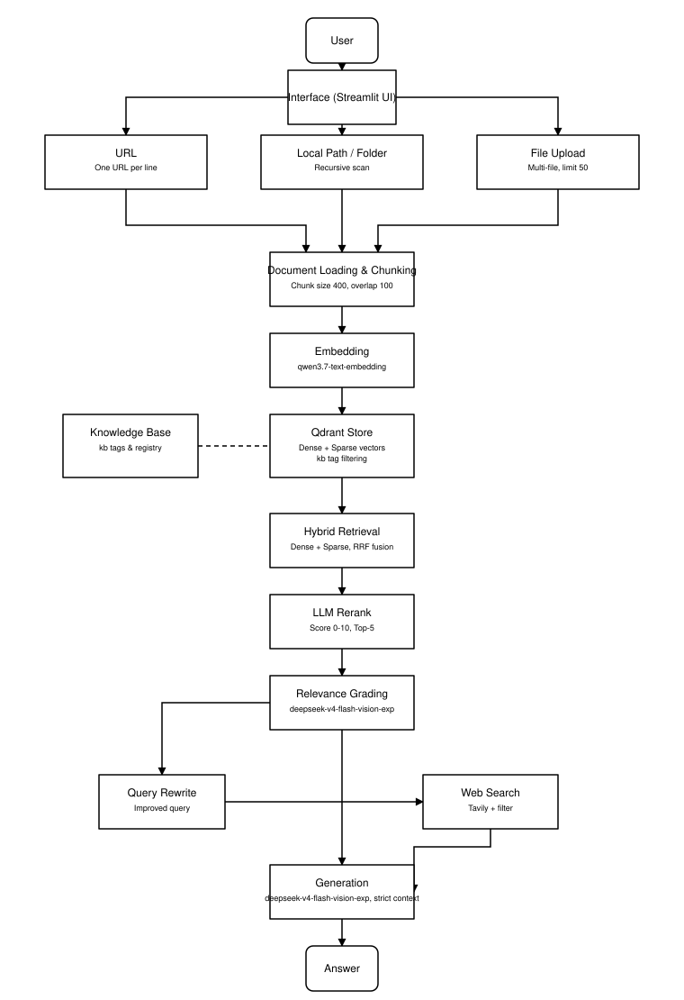

# 🔄 Corrective RAG Agent

## English

A corrective Retrieval-Augmented Generation (RAG) system with an async full-stack UI: FastAPI backend + Vue 3 frontend, orchestrated with Docker (Redis + Qdrant). It retrieves from local documents, grades relevance, rewrites the query when needed, falls back to web search, and generates strictly grounded answers streamed token-by-token over SSE. Evaluated end-to-end on a bundled benchmark: hybrid retrieval + LLM reranking + relevance filtering + strict generation reduced the hallucination rate to **0%** and reached **95% factual accuracy** on the 20-question subset.

### Features

- **Hybrid Retrieval**: dense vectors (qwen3.7-text-embedding) + keyword sparse vectors (jieba tokenization), fused with RRF
- **LLM Reranking**: the default LLM (deepseek-v4-flash-vision-exp) scores candidates (0-10) and keeps Top-5
- **Relevance Grading**: web search is only triggered when no local chunk is relevant
- **Web Search Fallback**: Tavily search with per-result relevance filtering
- **Strict Generation**: answers only from context; refuses instead of guessing when information is missing
- **Async API**: FastAPI backend with SSE streaming, retrieval-visualization events, and JSON endpoints
- **Streaming Answers**: token-by-token streaming (SSE) with ChatGPT-style typing effect
- **Retrieval Visualization**: the UI shows recalled candidates, their sources, and LLM rerank scores
- **Incremental Updates**: a file watcher enqueues new/changed documents to a Redis queue; a worker ingests them automatically and streams progress
- **Multi Knowledge Base**: single Qdrant collection + `kb` tag filtering (free-tier friendly)
- **Multi-Source Input**: URLs (one per line), local files/folders (recursive), multi-file upload (configurable limit, default 50)
- **Docker Deployment**: `docker-compose` runs `api`, `web`, `redis` (and optionally local `qdrant`)
- **Resilient**: automatic retries for network errors (max 4, exponential backoff)
- **.env Configuration**: all API keys read from `.env`; Chinese UI

### Project Structure

```text
src/corrective_rag/
  __init__.py       # package init
  core.py           # core logic: loaders, hybrid retrieval, reranking, LangGraph workflow
  api.py            # FastAPI backend (REST + SSE streaming, ingestion, watch endpoints)
  jobs.py           # Redis task queue + file-watcher worker for incremental updates
  evaluate.py       # LLM-as-judge evaluation (baseline RAG vs corrective RAG)
frontend/           # Vue 3 + Vite SPA (chat streaming, retrieval visualization, ingest, watcher)
  src/App.vue       # main UI
  src/api.js        # API client + SSE reader
tests/              # 38 pytest cases (no API keys required)
eval/               # benchmark corpus + 47-question evaluation set
docs/               # architecture diagram and UI screenshot
Dockerfile          # backend image
frontend/Dockerfile # frontend build + nginx image
docker-compose.yml  # api / web / redis / qdrant
.env.example        # configuration template
```

### Architecture



### How to Run

#### Option A — Docker Compose (recommended)

1. **Clone the Repository**:
   ```bash
   git clone https://github.com/ozlyyds04/Corrective-RAG-.git
   cd Corrective-RAG-
   ```

2. **Configure API Keys**:
   ```bash
   cp .env.example .env
   ```
   Fill in `.env`:
   - `LLM_API_KEY` / `LLM_BASE_URL` / `LLM_MODEL` — LLM API (default: DeepSeek official API; any OpenAI-compatible endpoint works)
   - `EMBEDDING_MODEL` / `EMBEDDING_API_KEY` / `EMBEDDING_BASE_URL` — embedding model (default: qwen3.7-text-embedding via DashScope compatible API)
   - `TAVILY_API_KEY` — web search
   - `QDRANT_URL` / `QDRANT_API_KEY` — Qdrant cluster (cloud, or `http://qdrant:6333` to use the bundled local service)

3. **Start the stack**:
   ```bash
   docker compose up --build
   ```
   - Web UI: <http://localhost:8081>
   - API: <http://localhost:8001>
   - Local Qdrant: <http://localhost:6333>

#### Option B — Local Development

1. **Install backend dependencies**:
   ```bash
   uv sync
   ```

2. **Run the backend API** (serves `http://localhost:8001`):
   ```bash
   uv run uvicorn corrective_rag.api:app --reload --port 8001
   ```

3. **Run the frontend** (in another terminal):
   ```bash
   cd frontend
   npm install
   npm run dev
   ```
   The Vite dev server proxies `/api` to the backend; open <http://localhost:5173>.

### Using the Application

- **Knowledge base**: create / select / delete a knowledge base
- **Ingest documents**: paste URLs (one per line), a local file/folder path, or upload files (with a configurable upper limit)
- **Incremental update**: start the file watcher on a directory; new/changed documents are auto-vectorized into Qdrant and progress is streamed
- **Ask a question**: the answer streams token-by-token, and each response shows the recalled sources with their rerank scores

### Testing & Evaluation

Run the test suite (no API keys required):

```bash
uv run pytest
```

Compare the corrective pipeline against a plain RAG baseline using LLM-as-judge metrics (retrieval precision@k, hit rate, faithfulness / hallucination rate, unsupported claims, factual correctness):

```bash
uv run python -m corrective_rag.evaluate --llm-api-key $LLM_API_KEY \
    --tavily-api-key $TAVILY_API_KEY --qdrant-url $QDRANT_URL
```

The evaluation set lives in `eval/questions.json` (47 questions), the corpus in `eval/data/`, and reports are written to `eval/reports/`.

### Tech Stack

- **LangChain / LangGraph**: orchestration and workflow management
- **FastAPI**: async backend, REST + SSE streaming
- **Vue 3 + Vite**: single-page frontend
- **Qdrant**: vector database (single collection, dense + sparse vectors, `kb` tag filtering)
- **Redis**: incremental-update task queue + event pub/sub
- **Docker Compose**: services orchestration (api / web / redis / qdrant)
- **qwen3.7-text-embedding**: embedding model via DashScope compatible API
- **deepseek-v4-flash-vision-exp** (default LLM): generation, relevance grading, query rewriting, reranking
- **Tavily**: web search fallback
- **jieba**: keyword tokenization for sparse retrieval

---

## 中文

一个基于 LangGraph 构建的纠正式检索增强生成（Corrective RAG）系统，配以异步全栈界面：FastAPI 后端 + Vue 3 前端，通过 Docker 编排（Redis + Qdrant）。从本地文档检索、相关性评分、必要时改写查询并联网兜底，最后严格基于上下文生成，并通过 SSE 逐字流式输出。通过配套基准评测验证：混合检索 + LLM 重排 + 相关性过滤 + 严格生成，使 20 题子集的**幻觉率降到 0%**，**事实正确率 95%**。

### 功能特性

- **混合检索**：稠密向量（qwen3.7-text-embedding）+ 关键词稀疏向量（jieba 分词），RRF 融合
- **LLM 重排**：默认大语言模型（deepseek-v4-flash-vision-exp）对候选打 0-10 分，取 Top-5
- **相关性评分**：本地片段全部不相关时才触发网络搜索
- **网络搜索兜底**：Tavily 搜索，结果逐条过滤后才进入生成
- **严格生成**：只基于上下文回答，资料不足时拒绝猜测
- **异步后端**：FastAPI + SSE 流式接口，支持检索可视化和 JSON 接口
- **流式输出**：SSE 逐 token 推送，ChatGPT 式打字效果
- **检索可视化**：界面展示召回片段、来源与 LLM 重排分数
- **增量更新**：文件监听把新增/变更文档推入 Redis 队列，后台 worker 自动向量化入库并流式推送进度
- **多知识库**：单集合 + `kb` 标签过滤（免费档友好）
- **多来源输入**：URL（每行一个）、本地文件/文件夹（递归）、多文件上传（上限可配置，默认 50）
- **Docker 部署**：`docker-compose` 编排 `api`、`web`、`redis`（可选本地 `qdrant`）
- **健壮性**：网络断连/超时自动重试（最多 4 次，指数退避）
- **.env 配置**：所有密钥从 `.env` 读取；中文界面

### 项目结构

```text
src/corrective_rag/
  __init__.py       # 包初始化
  core.py           # 核心逻辑：加载器、混合检索、重排、LangGraph 工作流
  api.py            # FastAPI 后端（REST + SSE 流式、入库、监听接口）
  jobs.py           # Redis 任务队列 + 文件监听 worker（增量更新）
  evaluate.py       # LLM-as-judge 评估（基线 RAG vs 纠错 RAG）
frontend/           # Vue 3 + Vite 单页应用（聊天流式、检索可视化、入库、监听）
  src/App.vue       # 主界面
  src/api.js        # API 客户端 + SSE 解析器
tests/              # 38 个 pytest 用例（无需 API 密钥）
eval/               # 评测语料 + 47 题评测集
docs/               # 架构图与界面截图
Dockerfile          # 后端镜像
frontend/Dockerfile # 前端构建 + nginx 镜像
docker-compose.yml  # api / web / redis / qdrant
.env.example        # 配置模板
```

### 架构图


### 如何运行

#### 方式一 — Docker Compose（推荐）

1. **克隆仓库**：
   ```bash
   git clone https://github.com/ozlyyds04/Corrective-RAG-.git
   cd Corrective-RAG-
   ```

2. **配置 API 密钥**：
   ```bash
   cp .env.example .env
   ```
   填写 `.env`：
   - `LLM_API_KEY` / `LLM_BASE_URL` / `LLM_MODEL` —— 大语言模型（默认 DeepSeek 官方 API；兼容任意 OpenAI 风格接口）
   - `EMBEDDING_MODEL` / `EMBEDDING_API_KEY` / `EMBEDDING_BASE_URL` —— 向量模型（默认 qwen3.7-text-embedding，走 DashScope 兼容接口）
   - `TAVILY_API_KEY` —— 网络搜索
   - `QDRANT_URL` / `QDRANT_API_KEY` —— Qdrant 集群（云端，或 `http://qdrant:6333` 使用内置本地服务）

3. **启动服务**：
   ```bash
   docker compose up --build
   ```
   - 网页界面：<http://localhost:8081>
   - API：<http://localhost:8001>
   - 本地 Qdrant：<http://localhost:6333>

#### 方式二 — 本地开发

1. **安装后端依赖**：
   ```bash
   uv sync
   ```

2. **启动后端 API**（监听 `http://localhost:8001`）：
   ```bash
   uv run uvicorn corrective_rag.api:app --reload --port 8001
   ```

3. **启动前端**（另开一个终端）：
   ```bash
   cd frontend
   npm install
   npm run dev
   ```
   Vite 会把 `/api` 代理到后端，打开 <http://localhost:5173>。

### 使用说明

- **知识库**：新建 / 选择 / 删除知识库
- **文档入库**：粘贴 URL（每行一个）、本地文件或文件夹路径、或上传文件（上限可配置）
- **增量更新**：对某个目录启动文件监听，新增/变更文档会自动向量化入库，进度实时推送
- **提问**：回答逐字流式展示，每个回答会附上召回来源及其重排分数

### 测试与评估

运行测试套件（不需要任何 API 密钥）：

```bash
uv run pytest
```

使用 LLM-as-judge 指标（检索精度 precision@k、命中率、忠实度/幻觉率、无支撑断言、事实正确率）对比基线 RAG 与纠错 RAG：

```bash
uv run python -m corrective_rag.evaluate --llm-api-key $LLM_API_KEY \
    --tavily-api-key $TAVILY_API_KEY --qdrant-url $QDRANT_URL
```

评测问题集在 `eval/questions.json`（47 题），语料在 `eval/data/`，报告输出到 `eval/reports/`。

### 技术栈

- **LangChain / LangGraph**：编排与工作流管理
- **FastAPI**：异步后端，REST + SSE 流式
- **Vue 3 + Vite**：单页前端
- **Qdrant**：向量数据库（单集合，稠密 + 稀疏向量，`kb` 标签过滤）
- **Redis**：增量更新任务队列 + 事件发布订阅
- **Docker Compose**：服务编排（api / web / redis / qdrant）
- **qwen3.7-text-embedding**：向量模型（DashScope 兼容接口）
- **deepseek-v4-flash-vision-exp**（默认大语言模型）：生成、相关性评分、查询改写、重排
- **Tavily**：网络搜索兜底
- **jieba**：关键词稀疏检索的分词
