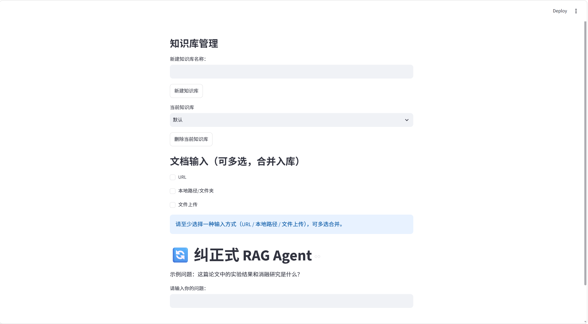

# 🔄 Corrective RAG Agent

## English

A corrective Retrieval-Augmented Generation (RAG) system built with LangGraph. It retrieves from local documents, grades relevance, rewrites the query when needed, falls back to web search, and generates strictly grounded answers. Evaluated end-to-end on a bundled benchmark: hybrid retrieval + LLM reranking + relevance filtering + strict generation reduced the hallucination rate to **0%** and reached **95% factual accuracy** on the 20-question subset.

### Features

- **Hybrid Retrieval**: dense vectors (qwen3.7-text-embedding) + keyword sparse vectors (jieba tokenization), fused with RRF
- **LLM Reranking**: the default LLM (deepseek-v4-flash) scores candidates (0-10) and keeps Top-5
- **Relevance Grading**: web search is only triggered when no local chunk is relevant
- **Web Search Fallback**: Tavily search with per-result relevance filtering
- **Strict Generation**: answers only from context; refuses instead of guessing when information is missing
- **Multi Knowledge Base**: single Qdrant collection + `kb` tag filtering (free-tier friendly)
- **Multi-Source Input**: URLs (one per line), local files/folders (recursive), multi-file upload (configurable limit, default 50)
- **Progress Feedback**: progress bars for both ingestion and answering
- **Resilient**: automatic retries for network errors (max 4, exponential backoff)
- **.env Configuration**: all API keys read from `.env`; Chinese UI

### Project Structure

```text
src/corrective_rag/
  __init__.py       # package init
  app.py            # Streamlit UI
  core.py           # core logic: loaders, hybrid retrieval, reranking, LangGraph workflow
  evaluate.py       # LLM-as-judge evaluation (baseline RAG vs corrective RAG)
tests/              # 36 pytest cases (no API keys required)
eval/               # benchmark corpus + 47-question evaluation set
docs/               # architecture diagram and UI screenshot
.env.example        # configuration template
```

### Preview

Architecture:


UI:



### How to Run

1. **Clone the Repository**:
   ```bash
   git clone https://github.com/ozlyyds04/Corrective-RAG-.git
   cd Corrective-RAG-
   ```

2. **Install Dependencies**:
   ```bash
   uv sync
   ```

3. **Configure API Keys**:
   ```bash
   cp .env.example .env
   ```
   Fill in the values in `.env`:
   - `LLM_API_KEY` / `LLM_BASE_URL` / `LLM_MODEL` — LLM API (default: DeepSeek official API; any OpenAI-compatible endpoint works)
   - `EMBEDDING_MODEL` / `EMBEDDING_API_KEY` / `EMBEDDING_BASE_URL` — embedding model (default: qwen3.7-text-embedding via DashScope compatible API)
   - `TAVILY_API_KEY` — web search
   - `QDRANT_URL` / `QDRANT_API_KEY` — Qdrant Cloud cluster

4. **Run the Application**:
   ```bash
   uv run streamlit run src/corrective_rag/app.py
   ```

5. **Use the Application**:
   - Create or select a knowledge base
   - Choose input sources (URL / local path/folder / file upload — multi-selectable and merged)
   - Ingest documents (watch the progress bar)
   - Ask a question and review each workflow step

### Testing & Evaluation

Run the test suite (no API keys required):

```bash
uv run pytest
```

Compare the corrective pipeline against a plain RAG baseline using LLM-as-judge metrics (retrieval precision@k, hit rate, faithfulness / hallucination rate, unsupported claims, factual correctness):

```bash
uv run python -m corrective_rag.evaluate --llm-api-key $LLM_API_KEY \
    --tavily-api-key $TAVILY_API_KEY --qdrant-url $QDRANT_URL
```

The evaluation set lives in `eval/questions.json` (47 questions), the corpus in `eval/data/`, and reports are written to `eval/reports/`.

### Tech Stack

- **LangChain / LangGraph**: orchestration and workflow management
- **Qdrant Cloud**: vector database (single collection, dense + sparse vectors, `kb` tag filtering)
- **qwen3.7-text-embedding**: embedding model via DashScope compatible API
- **deepseek-v4-flash** (default LLM): generation, relevance grading, query rewriting, reranking
- **Tavily**: web search fallback
- **Streamlit**: user interface
- **jieba**: keyword tokenization for sparse retrieval

---

## 中文

一个基于 LangGraph 构建的纠正式检索增强生成（Corrective RAG）系统：从本地文档检索、相关性评分、必要时改写查询并联网兜底，最后严格基于上下文生成回答。通过配套基准评测验证：混合检索 + LLM 重排 + 相关性过滤 + 严格生成，使 20 题子集的**幻觉率降到 0%**，**事实正确率 95%**。

### 功能特性

- **混合检索**：稠密向量（qwen3.7-text-embedding）+ 关键词稀疏向量（jieba 分词），RRF 融合
- **LLM 重排**：默认大语言模型（deepseek-v4-flash）对候选打 0-10 分，取 Top-5
- **相关性评分**：本地片段全部不相关时才触发网络搜索
- **网络搜索兜底**：Tavily 搜索，结果逐条过滤后才进入生成
- **严格生成**：只基于上下文回答，资料不足时拒绝猜测
- **多知识库**：单集合 + `kb` 标签过滤（免费档友好）
- **多来源输入**：URL（每行一个）、本地文件/文件夹（递归）、多文件上传（上限可配置，默认 50）
- **进度反馈**：入库和回答两个阶段都有进度条
- **健壮性**：网络断连/超时自动重试（最多 4 次，指数退避）
- **.env 配置**：所有密钥从 `.env` 读取；中文界面

### 项目结构

```text
src/corrective_rag/
  __init__.py       # 包初始化
  app.py            # Streamlit 界面
  core.py           # 核心逻辑：加载器、混合检索、重排、LangGraph 工作流
  evaluate.py       # LLM-as-judge 评估（基线 RAG vs 纠错 RAG）
tests/              # 36 个 pytest 用例（无需 API 密钥）
eval/               # 评测语料 + 47 题评测集
docs/               # 架构图与界面截图
.env.example        # 配置模板
```

### 界面预览

架构图：


界面截图：


### 如何运行

1. **克隆仓库**：
   ```bash
   git clone https://github.com/ozlyyds04/Corrective-RAG-.git
   cd Corrective-RAG-
   ```

2. **安装依赖**：
   ```bash
   uv sync
   ```

3. **配置 API 密钥**：
   ```bash
   cp .env.example .env
   ```
   填写 `.env` 中的配置：
   - `LLM_API_KEY` / `LLM_BASE_URL` / `LLM_MODEL` —— 大语言模型（默认 DeepSeek 官方 API；兼容任意 OpenAI 风格接口）
   - `EMBEDDING_MODEL` / `EMBEDDING_API_KEY` / `EMBEDDING_BASE_URL` —— 向量模型（默认 qwen3.7-text-embedding，走 DashScope 兼容接口）
   - `TAVILY_API_KEY` —— 网络搜索
   - `QDRANT_URL` / `QDRANT_API_KEY` —— Qdrant Cloud 集群

4. **运行应用**：
   ```bash
   uv run streamlit run src/corrective_rag/app.py
   ```

5. **使用应用**：
   - 新建或选择知识库
   - 选择输入来源（URL / 本地路径/文件夹 / 文件上传，可多选合并）
   - 入库文档（观察进度条）
   - 提问并查看每个工作流步骤

### 测试与评估

运行测试套件（不需要任何 API 密钥）：

```bash
uv run pytest
```

使用 LLM-as-judge 指标（检索精度 precision@k、命中率、忠实度/幻觉率、无支撑断言、事实正确率）对比基线 RAG 与纠错 RAG：

```bash
uv run python -m corrective_rag.evaluate --llm-api-key $LLM_API_KEY \
    --tavily-api-key $TAVILY_API_KEY --qdrant-url $QDRANT_URL
```

评测问题集在 `eval/questions.json`（47 题），语料在 `eval/data/`，报告输出到 `eval/reports/`。

### 技术栈

- **LangChain / LangGraph**：编排与工作流管理
- **Qdrant Cloud**：向量数据库（单集合，稠密 + 稀疏向量，`kb` 标签过滤）
- **qwen3.7-text-embedding**：向量模型（DashScope 兼容接口）
- **deepseek-v4-flash**（默认大语言模型）：生成、相关性评分、查询改写、重排
- **Tavily**：网络搜索兜底
- **Streamlit**：用户界面
- **jieba**：关键词稀疏检索的分词
